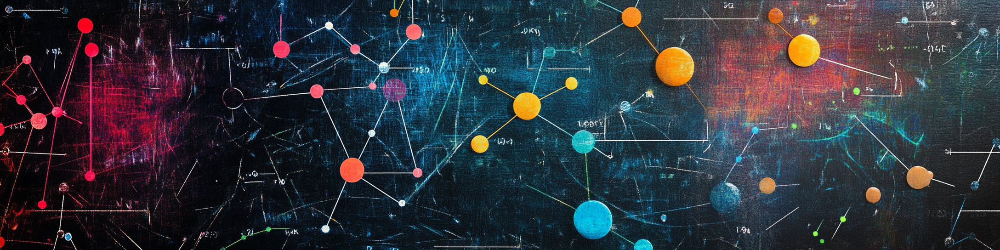

# MoDS: Mathematics of Data Science

**Course number:** Math 16:642:611 - Select Topics in Applied Math

**Semester:** Spring 2025

**Day/time and classroom:** TBA

**Number of credits:** 3

**Title:** Mathematics of Data Science

**Instructor:**  Facundo Mémoli

**Course description:** This course will explore various ideas from geometry and topology that have manifestations in Data Science. Examples include: Multidimensional Scaling, Hierarchical Clustering, Shape comparison through the Gromov-Hausdorff distance, Persistent Homology of metric spaces, Optimal Transport through the notions of the Wassertsein distance between probability measures and the Gromov-Wasserstein distance between metric measure spaces, as well as spectral methods as those used in Diffusion Geometry.  The choice of topics will be partly determined by the interest of participants in the course.

**Prerequisites:** undergraduate courses in topology, algebra and analysis.

**References:** there’s no single textbook for this course. We will follow several sources including:

+ A course in Metric Geometry. Burago, Burago and Ivanov. AMS.
+ Cox, Trevor F., and Michael AA Cox. Multidimensional scaling. CRC press, 2000.
+ Mémoli, Facundo. "Gromov–Wasserstein distances and the metric approach to object matching." Foundations of computational mathematics 11 (2011): 417-487.
+ Villani, Cédric. Topics in optimal transportation. Vol. 58. American Mathematical Soc., 2021.
+ Mémoli, Facundo. "Some properties of Gromov–Hausdorff distances." Discrete & Computational Geometry 48 (2012): 416-440.
+ Edelsbrunner, Herbert, and John L. Harer. Computational topology: an introduction. American Mathematical Society, 2022.
+ Chazal, Frédéric, Vin De Silva, and Steve Oudot. "Persistence stability for geometric complexes." Geometriae Dedicata 173.1 (2014): 193-214. 
+ Bérard, Pierre, Gérard Besson, and Sylvain Gallot. "Embedding Riemannian manifolds by their heat kernel." Geometric & Functional Analysis GAFA 4 (1994): 373-398.
+ Coifman, Ronald R., and Stéphane Lafon. "Diffusion maps." Applied and computational harmonic analysis 21.1 (2006): 5-30.
+ Kim, W. and Memoli, F. Persistence over posets. AMS Notices https://www.ams.org/notices/202308/rnoti-p1214.pdf.
     
